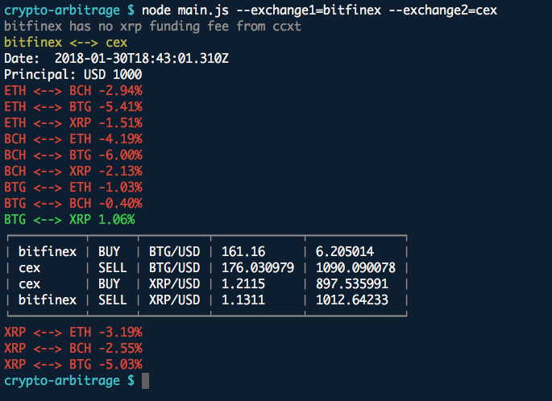

# crypto-arbitrage



### This repo is to figure out if one can profit by doing following steps:
1. Convert **10,000 USD** to **Coin X** in *Exchange 1*.
2. Transfer **Coin X** to *Exchange 2*.
3. Convert **Coin X** to **Coin Y** in *Exchange 2*.
4. Transfer **Coin Y** to *Exchange 1*.
5. Convert **Coin Y** back to **USD** in *Exchange 1*.

**Notes: Trading fees, funding fees and slippage are already considered in the calculation.**

---
## Install:
```sh
git clone https://github.com/dickenwong/crypto-arbitrage.git
cd crypto-arbitrage
npm install
```

---
## Command:
```sh
node main.js \
    --exchange1=<Exchange1> \
    --exchange2=<Exchange2> \
    --bridgingCoin=usd
    --initialCoin=usd \
    --initialAmount=10000 \

# Currently supported exchanges:
# - bitfinex
# - bitstamp
# - cex
# - exmo
```

| Params | Explanation |
|---|---|
| --exchange1 | Name of *Exchange 1* |
| --exchange2 | Name of *Exchange 2* |
| --bridgingCoin | (Default: usd) The bridging currency used to convert **Coin X** to **Coin Y** in *Exchange 2* |
| --initialCoin | (Default: usd) The currency spent to buy **Coin X** in *Exchange 1* |
| --initialAmount | (Default: 10000) Amount of initial currency |


---
## Result:
The format is `[CoinX] <--> [CoinY]  %Profit`. For example:
```sh
BCH <--> ZEC  -3.15%  # Lose 3.15%
BTG <--> BTC  1.37%   # Earn 1.37%
```

---
## Notes:
* Tickers are fetched by **cctx** (a great package for cryptocurrency data).
* Transaction time is neglected in this calculation.
* More profit can be achieved by lowering exchange trade fee (i.e. by a larger principal).

---
### TODO / Posible improvement:
* [ ] Support more exchanges
* [ ] Consider transaction time
* [ ] (Test it in real life!)
* [ ] Find optimal principal USD amount for highest return
* [ ] Real-time monitor (websocket)
* [ ] Handle trading here
